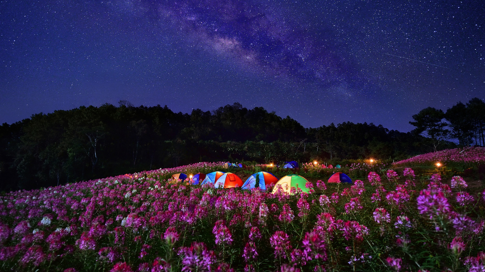

# Cabin Trip Sleepover

## What Are We Doing?

We're getting a cabin in the woods, and playing risk. I think.

## Primary Plan

### Use This [Link](https://docs.google.com/document/d/1koZweePlaOmFYY6wqEYLLmADBJMwEvWqINsihUVRP2M/edit)

[Use this link for the most updated plan.](https://docs.google.com/document/d/1koZweePlaOmFYY6wqEYLLmADBJMwEvWqINsihUVRP2M/edit)

### Outdated Plan Below

* **Logistics**
  * **Location- TBA, based upon what we want to do and availability**
    * **The spreadsheet previously shared is just the locations which would offer pontoon rentals, however there are many more options which can be considered.** 
    * **Previous areas discussed would be Ohio wine country, ie Geneva-on-the-Lake or Youngstown area.**
  * **Timing- fill out whenisgood poll or signup poll \(IDK, just use your name\), links below. From there, we will pick the collective best day and go from there. Present top days would be June 26, July 17, or August 14.**
    * **Signup-** [**www.signup.com/**](http://www.signup.com/)
    * **Whenisgood-** [**www.whenisgood.net/walsh-camp-2020**](http://www.whenisgood.net/walsh-camp-2020)
  * **For the weekend, we want to allow for people to come and go as needed, and people can visit without spending the night if concerned/issues.  Cars and logistics will be arranged closer to the date.** 
* **Costs**
  * **The goal is to be under $100 without special food or alcohol costs.**
    * **Spot rental- $30-50 each \(depending on location\)**
    * **Watersports rental- see spreadsheet on pontoons, kayaks are like $20-40** 
  * **Costs will be shared as equally as possible, address any issues with finances as things come up/**
* **Safety**
  * **Can be outlined further, it just depends upon the preferences of parents**
  * **Oldest person \(me\) is 23, and since we are all in college I’m not anticipating major concerns since we are adults.** 
* **Resources**
  * **Elise has way too many resources \(2 tents with combined “capacity” of 14 people, chairs, camp stoves, coolers, tarps, hammocks with straps, fishing polls, etc.\)**
  * **A spreadsheet will be made based upon peoples’ demands and needs and people will need to sign up accordingly for what they have.**  

## Cabins

### Punderson Manner \(Or Hillside Manor\)

* $160 inside the manner.
* 2 double beds.
* 4 people advertised.

### Thompson / Grand River Valley \(KOA\)

September 27-28

#### Amenities

* Fancy new heated pool.
* Located in the heart of wine country \(@ Maria M.\)
* Firewood for sale.
* Wifi
* Golf cart rentals.
* Jumping pillow?
* Outdoor game center: checkers, corn hole, horse shoes.

#### Housing Amenities \(4 people suggested; Sept. 27-28\)

* $117 before taxes & fees \($30/person/night with 4 people\)
* 2 single beds
* 1 bunk bed
* 1 full bed.
* 1 bedroom
* Pets allowed for extra money.

#### Housing Amenities \(6 people suggested\)

* $145/night before taxes & fees \($25/person\).

#### Housing Amenities

* $133/night.
* 1 bunk bed set
* 2 single beds
* 1 queen bed
* 1 bathroom. Full bath with shower.
* Linens provided
* Cable
* Partial kitchen.

### Delaware Water Gap \(KOA\)

* A 6 hour drive all across Pennsylvania
* When fall hits, it turns into a gorgeous place.

#### Location Amenities

* Outlet malls. Gift shops, candy stores, gum-ball.
* National parks.

#### Housing Amenities

* 4 People suggested.$134/night.
* 1 set of bunk beds
* 1 full bed.

### Ravenwood Castle

* Rooms inside the castle.
* Medieval cottages surrounding the place.
* 3 hour drive from Cleveland.
* Medieval games, like the malted meepball. \(Dungeons and Dragons\).
* 2hr drive from Dayton.
* 3hrs from Cleveland.

#### Housing: Duke's Dungeon \(Sex Dungeon\)

* $169/night.
* 1 bed. Technically only 2 people.
* In the castle.

#### Fletcher's Cabin

* $139/night before taxes/fees.
* Dishwasher, Microwave, Kitchen
* Kid-friendly unfinished sleeping loft.

#### Silversmith's House

* $279/night before taxes and fees.
* 6 people.
* Heart shaped bath with jets.

